# Database Schema

Single SQLite database (WAL mode). Full DDL: [`server/db/schema.sql`](../server/db/schema.sql).

## Conventions

- Every syncable table carries `uuid` (client-generatable), `updated_at`, and
  `deleted` (soft delete — rows are never physically removed, which keeps
  offline clients consistent and preserves the audit trail).
- Money is stored in **integer cents** with a currency code (default LRD) —
  no floating point in finance.
- Dates are ISO-8601 text. SQLite `datetime('now')` timestamps are UTC.
- Multi-tenancy: almost every table hangs off `schools.id`, so one database
  can hold many schools (cloud mode) or exactly one (school server mode).

## Entity-relationship diagram

```mermaid
erDiagram
    schools ||--o{ academic_years : has
    academic_years ||--o{ terms : has
    schools ||--o{ users : has
    schools ||--o{ classes : has
    schools ||--o{ subjects : has
    classes ||--o{ class_subjects : offers
    subjects ||--o{ class_subjects : taught_as
    users ||--o{ class_subjects : teaches
    classes ||--o{ timetable_slots : scheduled
    schools ||--o{ students : enrolls
    classes ||--o{ students : contains
    students ||--o{ student_guardians : linked
    guardians ||--o{ student_guardians : linked
    users ||--o| guardians : portal_login
    students ||--o{ attendance : marked
    students ||--o{ discipline_records : logged
    students ||--o{ student_transfers : moved
    classes ||--o{ assessments : assessed
    subjects ||--o{ assessments : in
    terms ||--o{ assessments : during
    assessments ||--o{ scores : records
    students ||--o{ scores : earns
    students ||--o{ report_cards : receives
    terms ||--o{ report_cards : for
    students ||--o{ promotions : decided
    students ||--o{ national_exams : registered
    schools ||--o{ staff : employs
    users ||--o| staff : account
    staff ||--o{ staff_attendance : marked
    staff ||--o{ leaves : requests
    staff ||--o{ payslips : paid
    staff ||--o{ evaluations : reviewed
    schools ||--o{ fee_structures : defines
    terms ||--o{ fee_structures : per
    students ||--o{ invoices : billed
    invoices ||--o{ payments : settled_by
    students ||--o{ payments : pays
    students ||--o{ scholarships : awarded
    schools ||--o{ expenses : spends
    schools ||--o{ budgets : plans
    schools ||--o{ donations : receives
    schools ||--o{ messages : sends
    schools ||--o{ announcements : posts
    schools ||--o{ meetings : schedules
    schools ||--o{ vehicles : owns
    schools ||--o{ bus_routes : runs
    bus_routes ||--o{ route_assignments : carries
    bus_routes ||--o{ bus_attendance : boards
    vehicles ||--o{ vehicle_maintenance : serviced
    schools ||--o{ books : catalogs
    books ||--o{ book_loans : lent
    schools ||--o{ assets : tracks
    schools ||--o{ procurements : buys
    schools ||--o{ audit_log : audited
```

## Table groups

| Group | Tables |
|---|---|
| Tenancy & calendar | `schools`, `academic_years`, `terms`, `calendar_events`, `lost_instruction_days` |
| People & auth | `users` (7 roles), `staff`, `guardians`, `student_guardians` |
| Students | `students` (incl. OVC / pregnancy-re-entry / medical fields), `attendance`, `discipline_records`, `student_transfers` |
| Academics | `classes`, `subjects`, `class_subjects`, `timetable_slots`, `lesson_plans`, `assessments`, `scores`, `report_cards` (immutable JSON snapshot), `promotions`, `national_exams`, `question_bank` |
| HR | `staff_attendance`, `leaves`, `payslips`, `evaluations`, `professional_development` |
| Finance | `fee_structures`, `invoices` (line items as JSON), `payments` (receipt numbers, momo references, reconciliation), `scholarships`, `expenses`, `budgets`, `donations` |
| Communication | `messages` (SMS outbox + two-way threads), `announcements`, `meetings` |
| Transport | `vehicles`, `bus_routes`, `route_assignments`, `bus_attendance`, `vehicle_maintenance` |
| Library & inventory | `books`, `book_loans`, `assets`, `procurements` |
| System | `audit_log`, `sync_ops` (idempotency keys for offline replay), `settings` (per-school key/value: grading config etc.) |

## Design decisions worth knowing

- **Report cards are snapshots.** `report_cards.data_json` freezes the computed
  per-subject results at publication time, so later score edits can't silently
  rewrite a distributed report card. Regeneration is an explicit action.
- **Offline idempotency.** Clients send `X-Op-Id` (a UUID) with each mutation.
  `sync_ops` stores the first result; replays return it instead of duplicating
  a payment or roll call. This is what makes the offline queue safe.
- **Attendance upsert.** `attendance` is unique on `(student_id, date)` — the
  bulk endpoint uses `ON CONFLICT ... DO UPDATE`, so re-marking a day corrects
  rather than duplicates.
- **Government vs school payroll.** `staff.payroll_type` distinguishes GoL
  payroll teachers (tracked read-only, `gov_payroll_no`) from school-funded
  staff, for whom payslips are computed.
- **PostgreSQL path.** The schema deliberately avoids SQLite-only types; the
  migration to Postgres for a national deployment is mechanical (see
  SCALABILITY.md).
